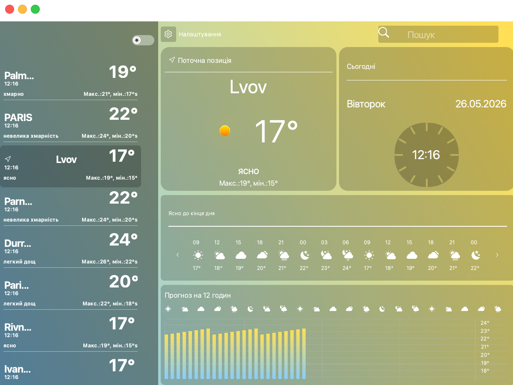
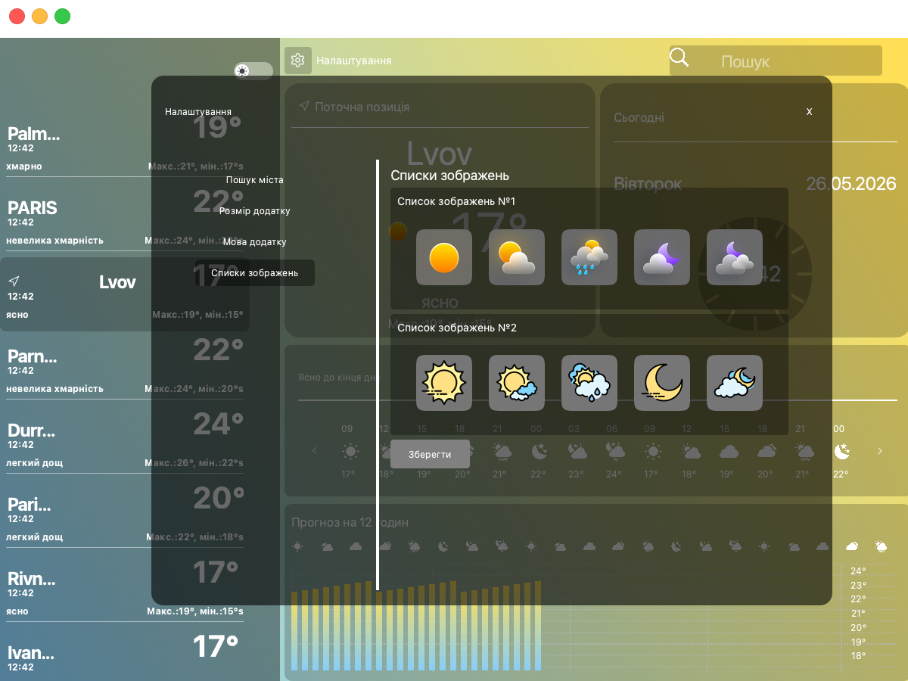

# Weather App

A desktop weather forecast app for tracking weather by city. The interface is built with **PyQt6**: saved cities are shown on the left, while the right side contains the detailed weather card, hourly forecast, chart, and settings.

<p align="center">
  
</p>

<p align="center">
  <sub>The screenshot uses local demo data; the app loads live weather from OpenWeatherMap when running normally.</sub>
</p>

## Features

- Shows current temperature, weather description, and daily high/low values.
- Displays an hourly weather strip and a separate 12-hour temperature chart.
- Stores the saved city list in `static/json/countries.json`.
- Supports Ukrainian and English interface languages.
- Lets you resize the app window and switch between light and dark backgrounds.
- Includes two selectable weather icon packs.
- Shows city coordinates and an interactive Folium map in the settings screen.

## Screenshots

### Settings and Icon Packs

<p align="center">
  
</p>

### Weather Icons

<p align="center">
  
  
</p>

## Tech Stack

| Area | Used |
| --- | --- |
| GUI | PyQt6, PyQt6 WebEngine |
| Weather data | OpenWeatherMap API |
| Cities | CountriesNow API |
| Map | Folium |
| Images | Pillow |
| Configuration | python-dotenv |

## Quick Start

### 1. Clone the project

```bash
git clone <repo-url>
cd weather-app
```

### 2. Create and activate a virtual environment

```bash
python -m venv venv
source venv/bin/activate
```

For Windows:

```powershell
python -m venv venv
venv\Scripts\activate
```

### 3. Install dependencies

```bash
pip install -r requirements.txt
```

### 4. Add an API key

Create a `.env` file in the project root:

```env
API_KEY=your_openweathermap_api_key
```

The key is loaded in `config.py` and should not be committed to git.

### 5. Run the app

```bash
python main.py
```

## Settings

The main configuration values are stored in `config.py`:

```python
LANGUAGE = "uk"
CHOOSE_IMAGE = "old"
```

`LANGUAGE` controls the interface language (`uk` or `en`), and `CHOOSE_IMAGE` selects the weather icon pack (`old` or `modern`). These options can also be changed from the settings window.

## Project Structure

```text
weather-app/
├── main.py                  # entry point
├── config.py                # env loading, language, selected icon pack
├── modules/                 # PyQt6 widgets and app screens
├── utils/                   # external API requests
├── static/json/             # saved city list
├── media/                   # backgrounds, buttons, and weather icons
├── docs/readme/             # README images
└── requirements.txt         # dependencies
```

## Important Files

- `modules/window.py` - main application window.
- `modules/card.py` - city card and active forecast selection logic.
- `modules/weather_per_hour.py` - hourly forecast UI.
- `modules/graphic.py` - 12-hour temperature chart.
- `modules/settings_main_part.py` - city, language, window size, and icon settings.
- `utils/api_request.py` - HTTP requests to OpenWeatherMap and CountriesNow.

## Notes

- A working internet connection is required for full functionality: the app loads weather, cities, geocoding data, and map tiles from external services.
- If `API_KEY` is missing or invalid, weather cards will not be able to load data.
- The city list can be edited from the interface, and the saved state is stored in `static/json/countries.json`.
